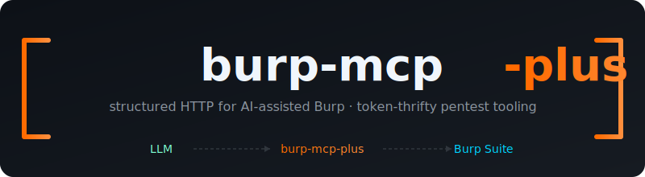
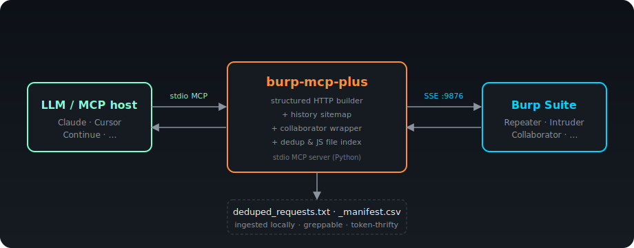

<div align="center">
  

  <p>
    <a href="LICENSE"></a>
    
    
    
    
    
  </p>

  <p><b>The MCP for Burp Suite that doesn't make your LLM hallucinate broken HTTP requests.</b></p>
</div>

---

## The problem

You hook up an LLM to Burp's official MCP server and ask it to "replay this request with a tampered cookie." It dutifully crafts a Repeater payload — and silently drops the `Cookie` header, gets a 401, and confidently tells you the endpoint requires no auth.

Or it forgets `Content-Length`. Or `Host`. Or uses LF instead of CRLF. Or pastes a JSON body with no headers at all.

This happens because the upstream Burp MCP takes a free-form `content` string. Whatever the model emits goes straight to the wire. There's no schema, no validation, no help.

The other thing that breaks long pentest sessions: **token cost**. Each `get_proxy_http_history` call ships kilobytes of repeated headers back to the model. Triage a target for an hour and you've burned a fortune re-paginating the same proxy history.

---

## What this fixes

**`burp-mcp-plus`** is a Python MCP wrapper that sits between your LLM and Burp's official MCP server. Two big ideas:

### 1. Structured input, not free-form strings

Every tool that touches HTTP takes typed fields — `method`, `path`, `set_headers`, `body` — and a *baseline* (a real entry from Burp's history, or a URL). The wrapper builds the wire format itself. Correct CRLF, auto-`Host`, auto-`Content-Length`, default `User-Agent`, inherited cookies. The LLM literally cannot produce a malformed request because there's no `content` parameter to put a malformed request in.

### 2. Local file ingestion for the boring stuff

If you've already triaged a target with the bundled `Deduped HTTP History + JS Exporter` Burp extension, the wrapper indexes the exports on disk. `dedup_search` and `js_search` return file:line + 60-char snippets — meaningfully cheaper than re-hitting Burp every time the model wants to look at past traffic. Full content is only fetched on demand.

---

## Architecture

<div align="center">
  
</div>

Plain Python stdio MCP server. Talks SSE to Burp's `mcp-proxy-all` extension on `localhost:9876`. Reads dedup/JS exports off disk. Works with any MCP host: Claude Desktop, Claude Code, Cursor, Continue, anything that speaks the protocol.

---

## Features

### Live Burp interaction

- **`list_history`** / **`search_history`** — paginate or regex over proxy history. Returns compact summaries (id + method + url + status), not raw bytes.
- **`inspect_history_entry`** — pretty-print one entry's headers, body, target.
- **`repeater_from_history`** — clone a baseline, mutate any subset of (method, path, headers, body), push to Repeater. **All other headers preserved verbatim from the baseline.** Cookies, auth tokens, Sec-Fetch-*, custom Anthropic-* / X-* headers — all carry through.
- **`repeater_from_template`** — build from scratch with a URL. Optionally inherit auth from a history baseline.
- **`send_request`** — same shape, but actually sends and returns the response. Skip the Repeater dance when you just want to test.
- **`intruder_from_history`** — push to Intruder with `§…§` payload markers wrapped automatically around substrings you specify.
- **`sitemap`** — host → method → paths tree, synthesized from history. Burp's MCP doesn't expose Target; we synthesize one.
- **`collaborator_generate`** / **`collaborator_check`** — OOB canary payloads + interaction polling.

### Local dedup file ingestion

Point at a `deduped_requests.txt` produced by the bundled extension and the model can search/replay endpoints from past sessions without round-tripping through Burp.

- **`dedup_load`** / **`dedup_list`** — register file(s) under a name.
- **`dedup_search`** — regex over `url` / `request` / `response` / `params` / `all`. Returns 60-char snippets.
- **`dedup_get`** — preview by default, full request/response on demand.
- **`dedup_to_repeater`** — replay a stored entry into a fresh Repeater tab with optional mutations. HTTP/2 lines auto-coerced to HTTP/1.1.

### Local JS-export ingestion

Point at a `_manifest.csv` produced by the bundled extension's JS Exporter and the model can grep across all the JavaScript captured for a target.

- **`js_load`** / **`js_list`** — register an export.
- **`js_files`** — browse the manifest, filter by host regex.
- **`js_search`** — grep across all on-disk JS. Returns file:line + snippet, max N matches per file (default 3). Transparently decodes the legacy `array('b', [...])` byte-list format that older versions of the extension produced.
- **`js_read`** — fetch full content for files of interest.

### Hardened against the real world

- Tolerates Burp's NDJSON-with-no-separators history format.
- Recovers parse-mid-stream when Burp truncates a long response with `... (truncated)`.
- `strict=False` JSON decoding for raw control bytes inside body strings.
- Specific error messages for empty inputs, status markers, malformed entries — pointing the model at the next tool to call.
- 20 tests covering wire-format building and edge cases (no Burp required to run them).

---

## Install

### 1. Burp side

Install **MCP Server** from Burp's BApp Store. Confirm it's listening on `http://127.0.0.1:9876` (Output tab).

If you want the dedup/JS ingestion features, install the bundled extension:

1. Set up Jython 2.7 in Burp → Settings → Extensions → Python environment.
2. Burp → Extensions → Installed → Add → Python → `burp-extension/deduped_history.py` from this repo.
3. Two new tabs appear: **Deduped History** and **JS Exporter**.

**Before you start capturing, two things the extension needs:**

- **Set your target scope.** Burp → Target → Scope → add the host(s) you're testing (e.g. `https://app.acme.com/.*`). The extension only dedupes/exports in-scope traffic, so this keeps the output clean and avoids ingesting random third-party noise (CDNs, analytics, etc.).
- **Pick an output directory for the JS Exporter.** In the **JS Exporter** tab, set the output dir + project name before browsing. Files land at `<output_dir>/<project>/<host>/<flattened-path>/<file>.js` along with a `_manifest.csv` that the wrapper indexes.

Then browse the target. The Deduped History tab fills as new endpoints appear; the JS Exporter tab fills as new `.js` / `.mjs` responses come through. Hit **Export** in the Deduped History tab to write `deduped_requests.txt`.

### 2. Wrapper side

Requires Python 3.11+ and [`uv`](https://docs.astral.sh/uv/).

```bash
git clone https://github.com/titaniumtushar/burp-mcp-plus.git
cd burp-mcp-plus
uv sync
uv run pytest                  # offline tests; no Burp required
```

### 3. Wire it into your MCP host

**Claude Desktop** (`~/Library/Application Support/Claude/claude_desktop_config.json` on macOS):

```json
{
  "mcpServers": {
    "burp": {
      "command": "/path/to/burp-suite-jdk/bin/java",
      "args": [
        "-jar", "/path/to/.BurpSuite/mcp-proxy/mcp-proxy-all.jar",
        "--sse-url", "http://127.0.0.1:9876"
      ]
    },
    "burp-plus": {
      "command": "/opt/homebrew/bin/uv",
      "args": [
        "run", "--directory", "/path/to/burp-mcp-plus", "burp-mcp-plus"
      ]
    }
  }
}
```

(Sample at [`examples/claude_desktop_config.json`](examples/claude_desktop_config.json).)

Restart the host. Tools appear as `mcp__burp-plus__*`.

**Claude Code CLI** uses a CLI command instead of a JSON file. From the repo directory:

```bash
# Add the wrapper (user scope = available in every project)
claude mcp add burp-plus --scope user -- \
  /opt/homebrew/bin/uv run --directory "$(pwd)" burp-mcp-plus

# Add the upstream Burp MCP too (adjust java + jar paths to your install)
claude mcp add burp --scope user -- \
  "/Applications/Burp Suite Professional.app/Contents/Resources/jre.bundle/Contents/Home/bin/java" \
  -jar "$HOME/.BurpSuite/mcp-proxy/mcp-proxy-all.jar" \
  --sse-url http://127.0.0.1:9876
```

Verify with `claude mcp list`. Tools appear in any Claude Code session as `mcp__burp-plus__*` and `mcp__burp__*`. Use `--scope project` if you want it scoped to the current repo only (writes to `.mcp.json`), or `--scope local` for just-this-machine config.

**Cursor** uses a JSON file like Claude Desktop, but at a different path. Edit `~/.cursor/mcp.json` (global, available in every workspace) — create the file if it doesn't exist:

```json
{
  "mcpServers": {
    "burp": {
      "command": "/Applications/Burp Suite Professional.app/Contents/Resources/jre.bundle/Contents/Home/bin/java",
      "args": [
        "-jar", "/Users/YOU/.BurpSuite/mcp-proxy/mcp-proxy-all.jar",
        "--sse-url", "http://127.0.0.1:9876"
      ]
    },
    "burp-plus": {
      "command": "/opt/homebrew/bin/uv",
      "args": [
        "run", "--directory", "/path/to/burp-mcp-plus", "burp-mcp-plus"
      ]
    }
  }
}
```

Then: Cursor → **Settings** (`⌘,`) → **MCP** → toggle both servers on. The status dot should go green; if it stays red, click **View logs** to see why. Use `.cursor/mcp.json` in a workspace root instead of `~/.cursor/mcp.json` if you want it scoped to one project.

**Continue / Cline / other stdio MCP hosts** — same JSON shape, host-specific config path. The wrapper itself doesn't care which host launches it; all it needs is a stdio pipe.

---

## The bundled Burp extension

`burp-extension/deduped_history.py` is a Jython extension I wrote (and fixed — see `CHANGELOG`-equivalent notes below) that produces the dedup/JS exports the wrapper indexes.

**Tab 1: Deduped History.** Watches proxy traffic. Adds a row only when a new (method, host, path, parameters) tuple appears. Re-fires when new query/body parameter names show up on an endpoint. Export the whole thing to `deduped_requests.txt`.

**Tab 2: JS Exporter.** Watches for JavaScript responses, saves each unique JS file to `<output>/<project>/<host>/<flattened-path>/<name>.js`, writes a `_manifest.csv`. Detects version strings from filenames and content hashes.

**Bug fix included:** Older versions wrote JS files as Python `array('b', [10, 10, ...])` literals instead of raw bytes (Jython slice-of-byte-array gotcha). The version in this repo writes proper bytes. The wrapper transparently decodes the old format too, so legacy exports keep working.

---

## Token economics

Rough numbers from a typical pentest session:

| Action | Upstream Burp MCP | burp-mcp-plus | Reduction |
| ------ | ---------------- | -------------- | --------- |
| List 50 history entries | ~60 KB | ~3 KB | 95% |
| Search history (regex, 30 hits) | ~90 KB | ~4 KB | 95% |
| Replay one auth'd request | ~5 KB request + ~5 KB confirmation | ~1 KB | 80% |
| Find an endpoint in past triage | re-paginate proxy (~60 KB) | dedup_search (~600 B) | 99% |
| Grep all JS for a pattern | not feasible | ~2 KB w/ snippets | — |

The wrapper's job is to keep the model focused on the smallest bytes that answer the question.

---

## Tested with

- Burp Suite Pro 2025.x
- Anthropic MCP Server BApp 1.x
- Claude Desktop on macOS
- Python 3.11, 3.12, 3.13
- macOS arm64, Linux x86_64

Should work on Windows but I haven't tested it. Reports welcome.

---

## Security notes

This is a **defensive tool for authorized testing.** It's no more dangerous than Burp itself — but:

- The MCP exposes your Burp's full power to whatever model you connect. Don't connect untrusted models.
- File ingestion (`dedup_*`, `js_*`) reads paths you provide. There's no sandbox; treat the wrapper's host as trusted.
- The wrapper doesn't authenticate to Burp's MCP — it relies on Burp's `localhost`-only binding. Don't expose Burp's MCP port externally.
- Pentest scope discipline applies. The wrapper makes it easier to fire requests; it doesn't validate that you should.

---

## Contributing

Issues and PRs welcome. A few ground rules:

- **Tests stay green.** `uv run pytest` before opening a PR. The builder in `src/burp_mcp_plus/builder.py` is pure logic and easy to test offline.
- **No new free-form `content` parameters.** That's the whole anti-pattern this tool exists to prevent. Add structured fields instead.
- **Compact returns.** If a new tool would return more than a few KB by default, add a `limit` / `field` / `preview` knob.
- **No hidden network calls.** Tool side effects should be obvious from the name.

---

## License

[MIT](LICENSE).

## Thanks

- **PortSwigger** — Burp Suite and the official MCP server.
- **Anthropic** — the MCP spec and Python SDK.
- Everyone running long pentest sessions who got tired of debugging "why did my LLM drop the Cookie header again."
